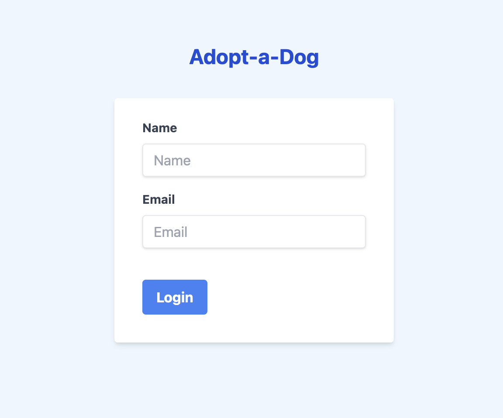
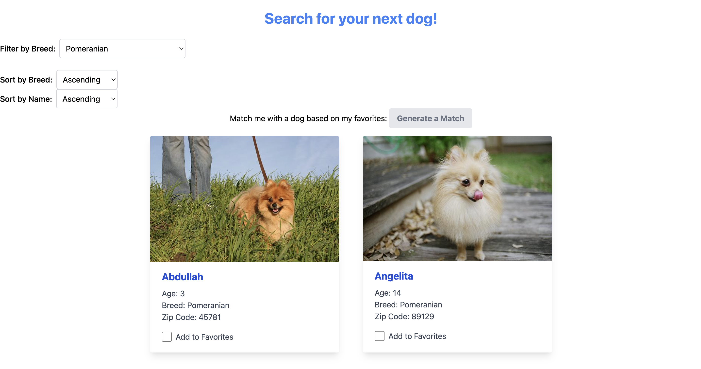
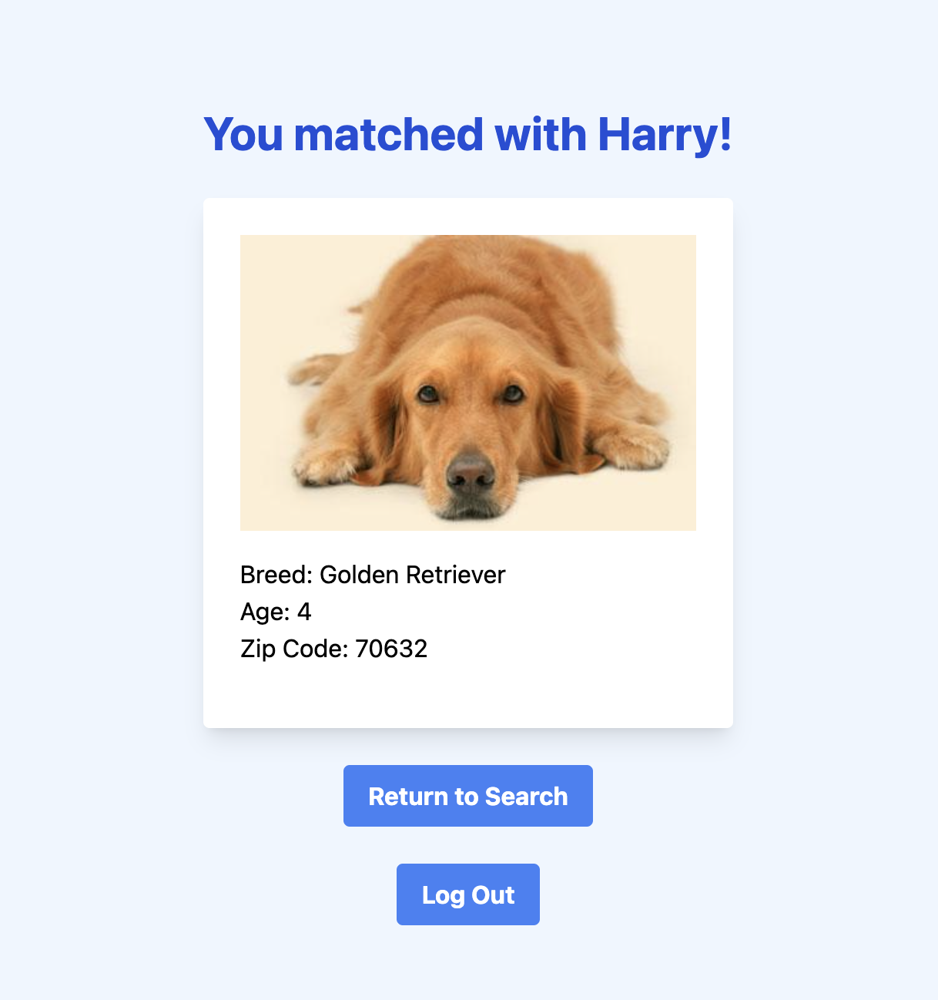

# Bring a dog home

Thinking about bringing a dog to your home, but don't know where to start? There are tens of thousands of dogs in shelters who would love to come home with you. Get started here!

---

Link to Live Site:
[https://adopt-a-dog-eta.vercel.app/](https://adopt-a-dog-eta.vercel.app/)

---

## Using the dog adoption site

1. Log into the website from your laptop or desktop using your name and email.

<!--  -->

2. Search through our database of dogs. You can favorite dogs that you are interested in adopting.

<!--  -->

3. Generate a match by clicking the **Generate a Match** button. This will take into account every dog you have favorited, and generate the perfect match for you. 

<!--  -->

## Running the site locally

If you would like to run the website on your local device. You can clone the GitHub repository and then utilize the following commands:

### `npm start`

Runs the app in the development mode.\
Open [http://localhost:3000](http://localhost:3000) to view it in your browser.

The page will reload when you make changes.\
You may also see any lint errors in the console.

### `npm test`

Launches the test runner in the interactive watch mode.\
See the section about [running tests](https://facebook.github.io/create-react-app/docs/running-tests) for more information.

### `npm run build`

Builds the app for production to the `build` folder.\
It correctly bundles React in production mode and optimizes the build for the best performance.

The build is minified and the filenames include the hashes.\
Your app is ready to be deployed!

See the section about [deployment](https://facebook.github.io/create-react-app/docs/deployment) for more information.

